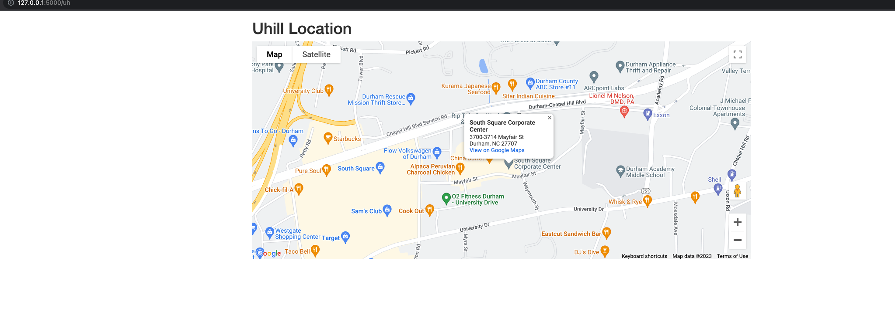

## A microservice based on flask and GoogleMapAPI 

## Goal
This is a flask based microservice and this project aims to help data engineers search for a location and get the details information of this lcoation.
## Usage
1. You need to register your own GoogleMap Credentials
2. Paste the keys to the project
3. use `flask run` to start the project

## Issues&Plans
1. Add more features
2. Add a more interactive way.
3. Perhaps change the output to a json file and easy for user to copy and paste

## Current Screenshots

## Reference

